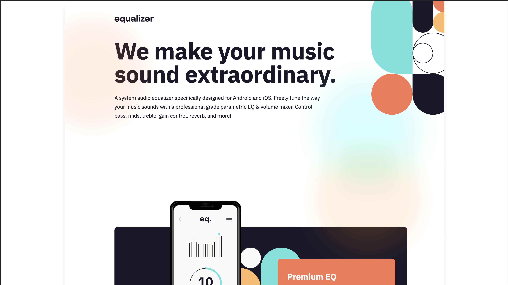
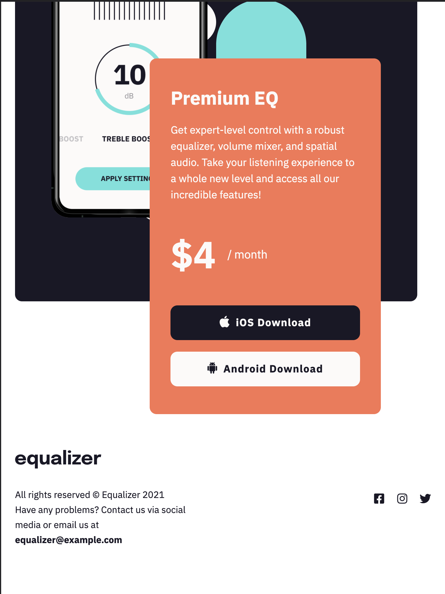
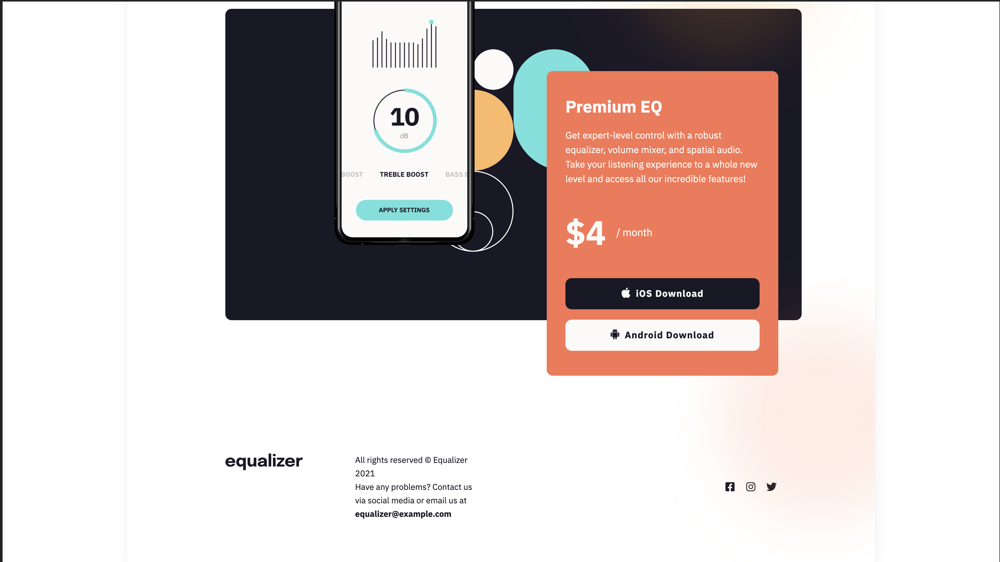

Frontend Mentor: [Equalizer landing Page solution](https://www.frontendmentor.io/challenges/equalizer-landing-page-7VJ4gp3DE/hub/equalizer-landing-page-CYlZ8d1ZA)

This is my solution to the [equalizer landing page challenge on Frontend Mentor](https://www.frontendmentor.io/challenges/equalizer-landing-page-7VJ4gp3DE/hub/equalizer-landing-page-CYlZ8d1ZA). Frontend Mentor challenges help you improve your coding skills by building realistic projects.

## Table of contents

- [Overview](#overview)
  - [The challenge](#the-challenge)
  - [Screenshot](#screenshot)
  - [Links](#links)
- [My process](#my-process)
  - [Built with](#built-with)
  - [What I learned](#what-i-learned)
  - [Continued development](#continued-development)
  - [Useful resources](#useful-resources)
- [Author](#author)
- [Acknowledgments](#acknowledgments)

## Overview

### The challenges

Users should be able to:

- See the optimal layout depending on the size of their devices' screen.

- See hover states for interactive elements.

### Screenshot

Here are the final screenshots of this project.

#### Mobile

#### Tablets

#### Desktops and Big Screens

### Links

- Solution URL: [Here's a link to my solution on Frontend Mentor](https://www.frontendmentor.io/solutions/using-gulp-and-sass-T_K8aSBH9).
- Live Site URL: [And here's the project in action](https://vercel.com/hcmwebs/equalizer-landing-page).

## My process

### Built with

- HTML5 markup
- Custom CSS using SASS
- CSS Grid
- CSS Flex-box
- CSS gap
- Mobile-first design
- Gulp

### What I learned

- overflow elements, gradients, positioning, sizing and positioning of background images and more ....

### Continued development

I'd like to learn more of how to change the colors of an image that is already an svg.

### Useful resources

- [Google](https://www.google.com) - Probably **the** most valuable tool in a web developers arsenal, frontend or backend. Any search engine would do, though.
- [W3Schools](https://www.w3schools.com)- With all the challenges of background images that I have, this page came in handy for me. I learnt a lot about positioning and sizing of the background images.The **_Play it>>_**, helped me see the clear picture.

- [CSS-Tricks](https://css-tricks.com) - After scratching my head for a while, I visited CSS-Tricks to learn more about changing colors of the svgs. It is amazing how fast and easy this is. Check out the **_Change Color of SVG on Hover_** article by [@chriscoyer](https://twitter.com/chriscoyier).

## Author

- Website - [hcmwebs](https://hcmwebs.com/) - Still needs a lot to be done!
- Frontend Mentor - [@Hcmwebs](https://www.frontendmentor.io/profile/Hcmwebs)
- Twitter - [@hcmwebs](https://twitter.com/hcmwebs)

## Acknowledgments

- **[Frontend Mentor](https://www.frontendmentor.io/)**: This has been a great game changer for my projects practice. With every project, there is a lot to learn and without a doubt, comes loaded with fun.
- **[Chris Coyer](https://twitter.com/chriscoyier)**: Without your clearly explained article on SVGs, I would still be scratching my head trying to figure out how to go about it. Thank you very much for sharing your knowledge through this and all your work.
